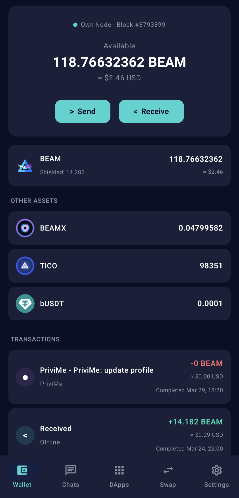
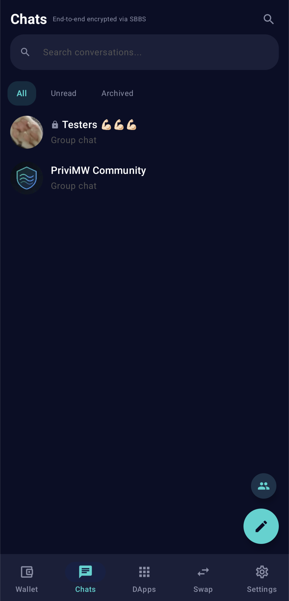
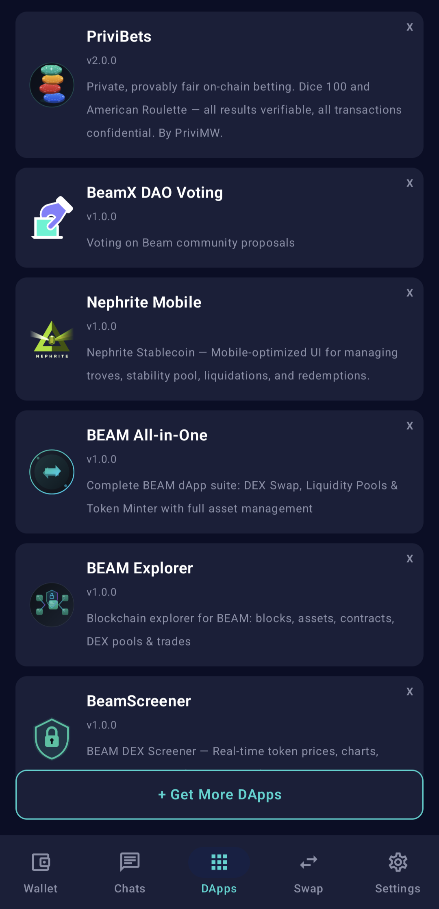
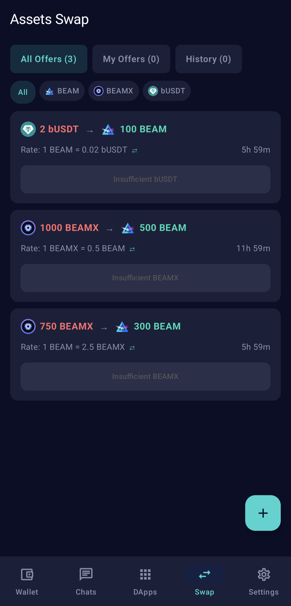
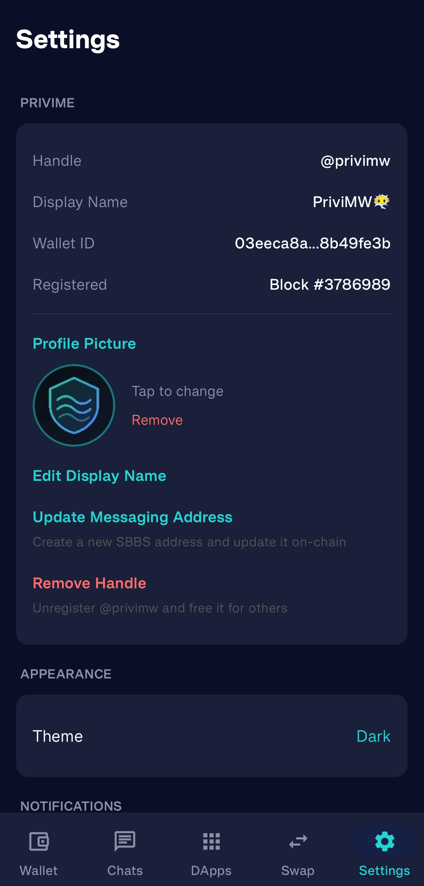

# PriviMW Wallet

Native Android wallet for the [Beam](https://beam.mw) privacy blockchain — encrypted messaging, group chats, DApp store, and confidential transactions.

**[Download Latest APK](https://github.com/PriviMW/PriviMW-Wallet/releases/latest)**

## Screenshots

<p align="center">
  
  
  
  
  
</p>

## Features

### Wallet

- **Send & Receive** — BEAM and Confidential Assets (offline, online, max privacy modes)
- **Assets Swap (DEX)** — Peer-to-peer asset trading. Create offers, accept swaps, fully private atomic settlement on-chain
- **Send to @handle** — Address wallet sends by human-readable handle names
- **Address Favourites** — Save frequently used addresses for quick sends
- **8 Themes** — Light and dark theme variants with full app-wide support
- **DApp Store** — Browse, install, and sideload Beam DApps
- **Mobile Node** — Optional FlyClient lightweight verification for trustless operation

### Messaging

- **End-to-End Encrypted DMs** — Peer-to-peer messaging via SBBS, no servers
- **Voice Messages** — Record and send Opus voice messages with waveform visualization
- **Message Reactions** — Add emoji reactions to messages, merged into chat notifications
- **Group Chats** — On-chain groups with admin roles, bans, invites, password-protected private groups, @mention autocomplete
- **Delete Messages** — Unsend messages from conversations
- **Media Gallery** — View images, audio, and files with fullscreen viewer
- **Profile Pictures** — Peer-to-peer avatar exchange via SBBS
- **Stickers** — Custom packs with animated TGS/Lottie support
- **Tips** — Send BEAM/assets directly in chat conversations
- **Polls** — Create and vote on polls in DM and group chats

## Privacy & Security

- **No servers** — All messaging is peer-to-peer via Beam's SBBS (Secure Bulletin Board System)
- **End-to-end encrypted** — Messages encrypted per-recipient using public key cryptography
- **Encrypted local storage** — SQLCipher database with Android Keystore-backed encryption
- **No tracking** — No analytics, no telemetry, no cloud backups
- **Brute-force protection** — Exponential lockout on failed password attempts
- **Transaction auth** — Password/biometric required for all fund transfers
- **On-chain privacy** — All wallet transactions use Beam's MimbleWimble confidential amounts
- **Open source** — Full source code available for audit

### What stays on your device

- Chat messages, media, stickers
- Profile pictures
- Wallet database and keys
- App settings and preferences

### What goes on-chain

- Handle registration (public key + encrypted SBBS address)
- Group membership records (handle + role)
- Group metadata (name, settings — not message content)
- Wallet transactions (confidential amounts via MimbleWimble)

**Message content is NEVER stored on-chain.** All messages are transmitted via SBBS and stored locally.

## Tech Stack

- **Language**: Kotlin + Jetpack Compose
- **Wallet Core**: Beam C++ via JNI (`libwallet-jni.so`)
- **Database**: Room + SQLCipher (encrypted)
- **Network**: Beam Mainnet (SBBS for messaging, BVM for contracts)
- **Min SDK**: Android 7.0 (API 24)
- **Target SDK**: Android 15 (API 35)
- **CPU Architecture**: arm64-v8a only (64-bit devices)

## Building

### Prerequisites

- Android Studio Ladybug+
- JDK 17
- Android SDK 35, NDK 27

### Build

Initialize git submodules for Opus and Ogg sources (voice message encoding):

```bash
git submodule update --init --recursive
```

Then build:

```bash
./gradlew assembleDebug
```

### Install

```bash
adb install -r app/build/outputs/apk/debug/app-debug.apk
```

## Architecture

```
app/src/main/java/com/privimemobile/
├── chat/                  # Messaging system
│   ├── contacts/          # Contact resolution
│   ├── db/                # Room database (entities, DAOs)
│   ├── group/             # Group chat manager + PendingTx
│   ├── identity/          # Handle registration + profile
│   ├── notification/      # Chat notification manager (reactions + messages)
│   ├── processor/         # SBBS message processing
│   ├── transport/         # SBBS transport layer
│   ├── voice/             # Opus voice message recording
│   └── ChatService.kt    # Singleton orchestrator
├── protocol/              # Beam JNI bridge, SBBS, config, types, secure storage
├── wallet/                # Wallet manager, TX auth, swap manager, update checker, notifications
├── dapp/                  # DApp WebView bridge + native TX approval
├── ui/                    # Jetpack Compose screens
│   ├── auth/              # Onboarding, lock screen
│   ├── chat/              # DMs, groups, registration, search, media gallery
│   ├── components/        # AvatarDisplay, AvatarPicker, VoiceMessageBubble
│   ├── dapps/             # DApp store + viewer
│   ├── navigation/        # Nav graph
│   ├── settings/          # Settings screen
│   ├── theme/             # 8-theme system (light/dark variants)
│   └── wallet/            # Send, receive, swap, addresses, UTXO, TX detail
├── MainActivity.kt
└── PriviMWApp.kt          # Application entry point
```

## Native Libraries

The pre-compiled native libraries are built from our open-source Beam forks:

| Library | Source | Description |
|---------|--------|-------------|
| `libwallet-jni.so` | [PriviMW/beam](https://github.com/PriviMW/beam) | Beam C++ wallet core (MimbleWimble, SBBS, BVM) |
| `libipfs-bindings.so` | [PriviMW/asio-ipfs](https://github.com/PriviMW/asio-ipfs) | IPFS transport bindings |

Forked from the official [BeamMW/beam](https://github.com/BeamMW/beam) with minimal changes for mobile compatibility.

Voice messages use a separate JNI library (`libvoice.so`) built from official Opus + Ogg sources in `app/src/main/jni/` — compiled directly during APK build via CMake.

## Smart Contracts

The PriviMe and PriviBets smart contract source code is in [privimw-dapps](https://github.com/PriviMW/privimw-dapps). The compiled `app.wasm` shader is bundled in `app/src/main/assets/`.

## Ecosystem

- [Beam](https://beam.mw) — Privacy blockchain
- [Beam Explorer](https://explorer.beam.mw) — Block explorer
- [Beam Documentation](https://documentation.beam.mw) — Developer docs
- [PriviMW DApps](https://github.com/PriviMW/privimw-dapps) — Smart contracts
- [PriviMW Beam Fork](https://github.com/PriviMW/beam) — C++ wallet core source
- [PriviMW IPFS Fork](https://github.com/PriviMW/asio-ipfs) — IPFS bindings source

## Donate

Support PriviMW development (BEAM):

```
176c4cba6ccaed3d9762a9c712f616f945161550ebe4fcf6e7af3530916bc0ea3e0
```

## License

Apache License 2.0 — see [LICENSE](LICENSE)
